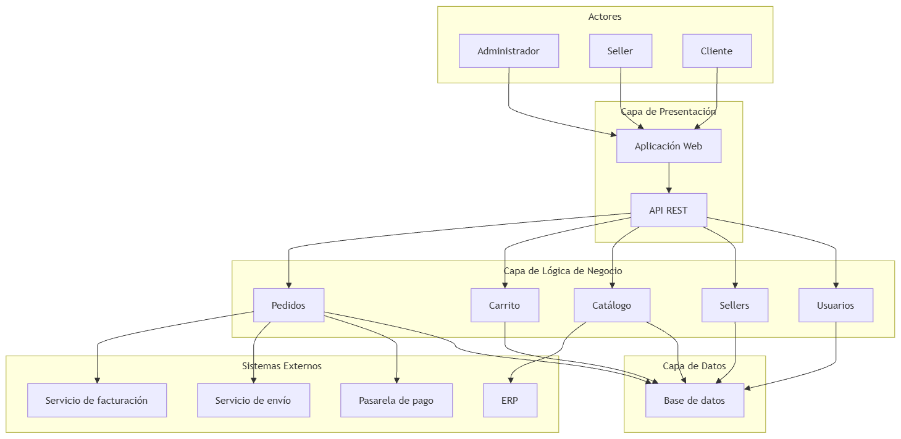

## 1. Capa de Presentación

La capa de presentación permite la interacción entre los usuarios y el sistema.

### Componentes

- Aplicación Web
- API REST

### Responsabilidades

- Mostrar productos disponibles.
- Recibir las acciones realizadas por clientes, sellers y administradores.
- Mostrar información de pedidos, carrito y productos.
- Enviar las solicitudes del usuario hacia la capa de lógica de negocio.
- Mostrar las respuestas generadas por el sistema.

## 2. Capa de Lógica de Negocio

La capa de lógica de negocio contiene las reglas y procesos principales del Marketplace.

### Módulos

#### Usuarios

Gestiona la información y operaciones relacionadas con los usuarios del sistema.

Responsabilidades:

- Gestionar información de clientes.
- Gestionar autenticación y autorización.
- Validar las operaciones que puede realizar cada tipo de usuario.

#### Sellers

Gestiona a los vendedores registrados en la plataforma.

Responsabilidades:

- Registrar sellers.
- Actualizar información de sellers.
- Desactivar sellers.
- Gestionar la información relacionada con los vendedores.

Relacionado con:

- HU05
- RF07

#### Catálogo

Gestiona los productos disponibles en el Marketplace.

Responsabilidades:

- Registrar productos.
- Actualizar productos.
- Consultar productos.
- Buscar productos.
- Consultar disponibilidad.

Relacionado con:

- HU01
- HU02
- RF01
- RF02
- RF03

#### Carrito

Gestiona temporalmente los productos seleccionados por el cliente antes de realizar una compra.

Responsabilidades:

- Agregar productos al carrito.
- Modificar productos del carrito.
- Eliminar productos del carrito.
- Consultar el contenido del carrito.

Relacionado con:

- HU03
- RF04

#### Pedidos

Gestiona el proceso de compra realizado por el cliente.

Responsabilidades:

- Crear un pedido a partir del carrito.
- Consultar pedidos realizados.
- Consultar el detalle de un pedido.
- Gestionar el estado del pedido.
- Coordinar el procesamiento del pago.
- Coordinar la información de envío.

Relacionado con:

- HU04
- HU06
- RF05
- RF06
- RF08

## 3. Capa de Datos

La capa de datos es responsable de almacenar y recuperar la información utilizada por el Marketplace.

### Componente

- Base de datos

### Información almacenada

- Usuarios.
- Sellers.
- Productos.
- Carritos.
- Pedidos.
- Información relacionada con las operaciones del sistema.

### Responsabilidades

- Guardar información persistente.
- Consultar información requerida por la capa de negocio.
- Actualizar los datos del sistema.
- Mantener la consistencia de la información.

## Dependencias entre capas

La comunicación entre las capas sigue el siguiente flujo:

Presentación → Lógica de Negocio → Datos

La capa de presentación no debe acceder directamente a la base de datos.

Las operaciones solicitadas por los usuarios son procesadas primero por la capa de lógica de negocio, y esta capa utiliza la capa de datos cuando necesita almacenar o recuperar información.

## Diagrama final de arquitectura

El siguiente diagrama integra los actores, las capas del sistema y los sistemas externos.

